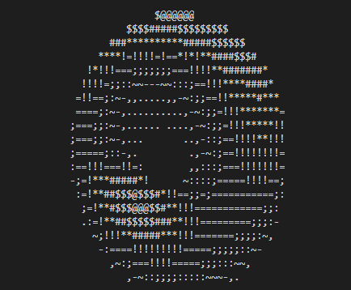

# Donut
Inspired by a YouTuber called Joma Tech [Here](https://youtu.be/sW9npZVpiMI?si=q6x9bQ5tLD9I7web)

## Reference
Based on spinning ASCII [Donut](https://www.a1k0n.net/2011/07/20/donut-math.html)  

* https://gist.github.com/gcr/1075131
* https://github.com/hadal1337/ASCII-Doughnut/blob/master/ASCII%20Doughnut.cpp

